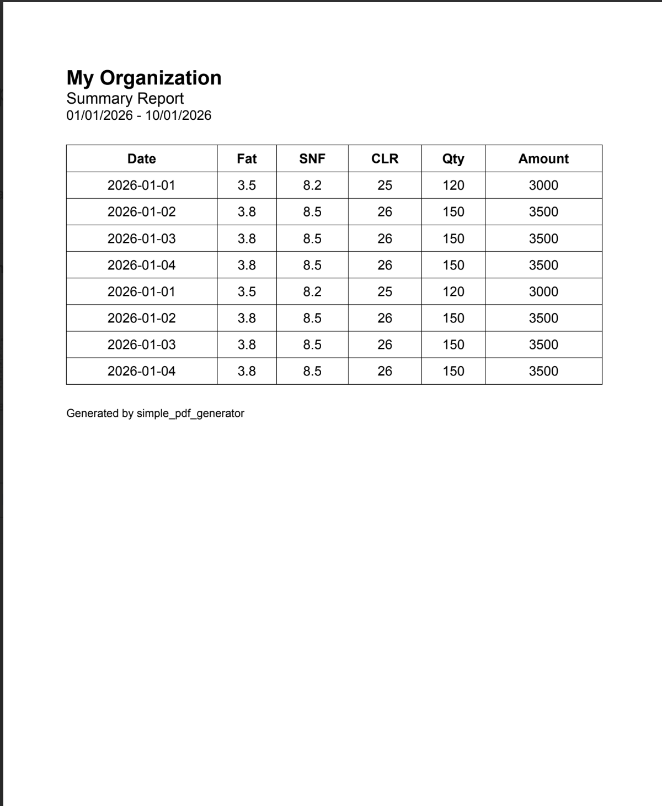

# simple_pdf_generator

A lightweight Flutter package for generating PDFs from structured data with minimal boilerplate.

## Overview

Building PDFs in Flutter often means a lot of repetitive layout code: tables, alignment, row formatting, headers, and footers. This package focuses on that workflow so you can pass structured data (for example maps or API models) and get a usable PDF with a small, readable API.

## What it helps with

- Less repetitive PDF layout code
- Tables built from lists and optional column mapping
- Consistent header and footer blocks
- Faster reporting, billing, and export features

## Features

- Simple `SimplePdf.generate` API
- Tables from structured data with optional `mapper` for dynamic or nested sources
- Configurable header (`title`, `subtitle`, `extra`) and optional footer
- Small surface area and a thin dependency on [`pdf`](https://pub.dev/packages/pdf)

## Installation

Add `simple_pdf_generator` to your `pubspec.yaml`.

**From pub.dev** (when published):

```yaml
dependencies:
  simple_pdf_generator: ^0.0.1
```

**Local path** (during development):

```yaml
dependencies:
  simple_pdf_generator:
    path: ../simple_pdf_generator
```

Run `flutter pub get`.

## Usage

Import the library:

```dart
import 'package:simple_pdf_generator/simple_pdf_generator.dart';
```

### Basic example

When your rows are already maps whose keys match the column headers:

```dart
final pdf = await SimplePdf.generate(
  header: PdfHeader(
    title: 'My Organization',
    subtitle: 'Summary Report',
    extra: '01/01/2026 – 10/01/2026',
  ),
  table: PdfTable(
    headers: ['Name', 'Age'],
    data: [
      {'Name': 'John', 'Age': 28},
      {'Name': 'Alice', 'Age': 24},
    ],
  ),
  footer: PdfFooter(text: 'Generated by simple_pdf_generator'),
);
```

### Using a mapper

Use `mapper` when your source data does not match header names (for example API or database records):

```dart
final pdf = await SimplePdf.generate(
  header: PdfHeader(title: 'Report'),
  table: PdfTable(
    headers: ['Date', 'Amount'],
    data: apiResponse,
    mapper: (item) => {
      'Date': item['date'].toString(),
      'Amount': item['amount'].toString(),
    },
  ),
);
```

`generate` returns a `Document` from the `pdf` package. Persist it with `save()`:

```dart
import 'dart:io';

// ...

final bytes = await pdf.save();
final file = File('${directory.path}/report.pdf');
await file.writeAsBytes(bytes);
```

To open the file on device, you can use packages such as [`path_provider`](https://pub.dev/packages/path_provider) and [`open_file_safe`](https://pub.dev/packages/open_file_safe). See the `example/` app in this repository for a full flow.

## Example output

The following sample was generated with the example app: header, tabular data (with a mapper), and footer.



More features are on the way—see [Roadmap](#roadmap) for planned work.

## API summary

| Type        | Role |
|------------|------|
| `SimplePdf` | `generate(...)` builds the PDF document |
| `PdfHeader` | `title` (required), optional `subtitle`, `extra` |
| `PdfTable`  | `headers`, `data`, optional `mapper` |
| `PdfFooter` | Optional `text` |

## Roadmap

- Multiple templates (invoice, receipt, and similar)
- Table styling and customization
- Sorting and richer formatting
- Multi-language support
- Font customization

## Contributing

Issues and pull requests are welcome.

## License

MIT License. See [LICENSE](LICENSE).
